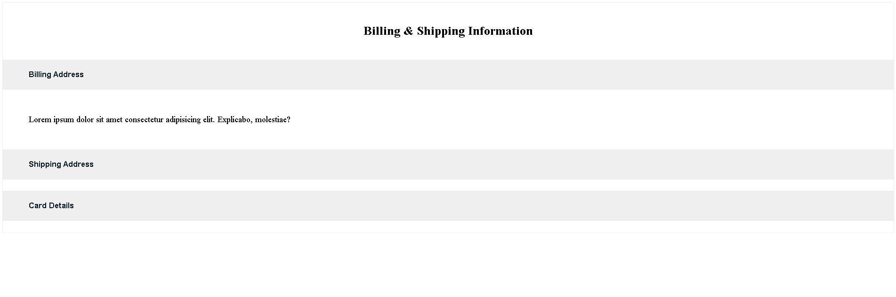

# React Accordion

A simple accordion component built with React that allows users to expand and collapse content sections.

## Features

- Expand and collapse sections
- Only one section can be open at a time
- Toggle open/close functionality
- Built with React Hooks
- Responsive design

## Technologies

- React
- JavaScript
- CSS
- useState

## Preview



## Installation

```bash
npm install
npm run dev
```

## Project Structure

```text
src/
├── Accordion.jsx
├── accordion.css
└── App.jsx
```

## Author

Setareh Kazemi
